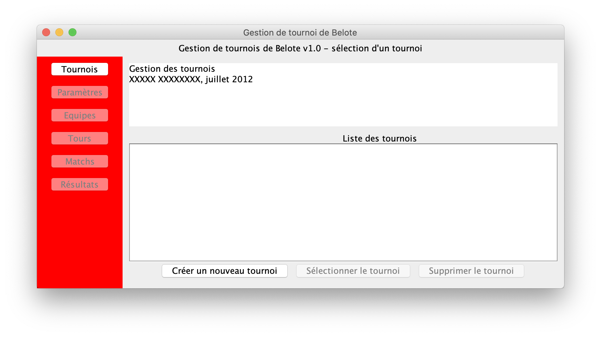

// ------------------------------------------
//  Created by Jean-Michel Bruel on 2019-12.
//  Copyright (c) 2019 IRIT/U. Toulouse. All rights reserved.
// Thanks to Louis Chanouha for code & idea
// ------------------------------------------
= BUT-Info/S4.A.01 : Projet refactoring
Jean-Michel Bruel, Louis Chanouha, Mahmoud Elhamlaoui
v23.1, {localdate}
:mailto: jbruel@gmail.com
:status: bottom
:inclusion:
:experimental:
:toc: toc2
:icons: font
:window: _blank
:asciidoctorlink: link:http://asciidoctor.org/[Asciidoctor]indexterm:[Asciidoctor]

// Useful definitions
:asciidoc: http://www.methods.co.nz/asciidoc[AsciiDoc]
:icongit: icon:git[]
:git: http://git-scm.com/[{icongit}]
:plantuml: https://plantuml.com/fr/[plantUML]
:vscode: https://code.visualstudio.com/[VS Code]

ifndef::env-github[:icons: font]
// Specific to GitHub
ifdef::env-github[]
:!toc-title:
:caution-caption: :fire:
:important-caption: :exclamation:
:note-caption: :paperclip:
:tip-caption: :bulb:
:warning-caption: :warning:
:icongit: Git
endif::[]

// /!\ A MODIFIER !!!
:baseURL: https://github.com/IUT-Blagnac/sae4-01-template

// Tags
image:{baseURL}/actions/workflows/build.yml/badge.svg[Build] 
image:{baseURL}/actions/workflows/tests.yml/badge.svg[Tests] 
image:https://img.shields.io/badge/License-MPL%202.0-brightgreen.svg[License: MPL-2.0, link="https://opensource.org/licenses/MPL-2.0"]
//---------------------------------------------------------------

TIP: Pensez à mettre à jour les infos dans ce fichier pour que les badges pointent sur les résultats effectifs de vos intégrations continue ou sur la bonne licence logicielle.

== _Refactoring_ d'un code existant

WARNING: Ce dépôt présente le projet à développer dans le cadre de la SAÉ 4.A.01 du BUT1 Informatique de l'IUT de Blagnac.

Ce fichier `README.adoc` (dont vous lisez sûrement le rendu HTML automatiquement effectué par GitHUb), fait partie du dépôt initial cloné à partir du lien GitHub classroom qui vous a été donné par ailleurs.
Vous trouverez le dépôt "template" qui a servi de base ici : https://github.com/IUT-Blagnac/sae4-01-template. 

== Équipe

Projet est réalisé par::

- https://github.com/janeDoe[Jane Doe]
- https://github.com/johnSmith[John Smith]
...

== Contexte général

TIP: Cette partie de votre `README.adoc` peut être supprimée ou mise ailleurs.

Vous trouverez link:Belote2023.zip[ici] le lien vers un projet écrit par un ancien étudiant de l'IUT de Blagnac (à l'époque ou cette SAÉ n'existait pas). 
L'application permet de gérer un tournoi de Belote: saisie des participants, des scores, génération des matchs et visualisation des résultats. 
Elle a été codée avec Java + Swing (différent de Java FX que vous avez étudié en cours) + un stockage au format SQL.

Ce projet est un projet {Eclipse}. 
Pour l'importer dans cet  IDE, cliquez sur menu:File[Import...>General>Existing Projects into Workspace>Next>Select archive file>Finish].

Commencez par étudier l'application, sans vous précipiter :

- Analysez en détails les fonctionnalités du logiciel, les différentes étapes d'un tournoi. Vous pouvez vous aider d'un schéma ou un diagramme de séquence système UML.
- Que pensez-vous de l'organisation et la visibilité du code ? Peut-on facilement le faire évoluer pour ajouter par exemple une deuxième fenêtre plein écran pour affichage sur un projecteur ?
- Que améliorations proposez-vous ?

== Travail à effectuer

Vous avez 4 semaines (à 3 séances par semaines) en semaines 11-14 pour améliorer le plus possible le code de cette application, en y intégrant vos acquis de l'IUT abordés dans les ressource R3.02, R3.03, R3.04, R4.01, R4.02 :

Améliorations obligatoires::
- intégration de patrons de conception. Cela peut être ceux vus en cours, ou d'autres (il y en a plein, cf. https://refactoring.guru/),
- application de bonnes pratiques de la conceptions orientée objet. Pensez à SOLID, l'encapsulation, votre expérience en développement Java !

Améliorations facultatives::
- passer l'application en multilingue de manière générique
- convertir le projet pour y inclure un système de build
- permettre à l'application de fonctionner avec n'importe quelle BD relationnelle
- proposer des fonctionnalités supplémentaires, dont le développement a été  facilité par votre refactoring

WARNING: Commencez d'abord par établir un objectif et vous répartir les tâches ! Vous perdrez énormément de temps si vos changements s'avèrent non adaptés à l'application ! N'hésitez pas à valider vos idées avec votre intervenant.

TIP: Commencez par le plus simple. Le patron le plus complexe n'est pas toujours le plus adapté !

TIP: Dans votre étude, anticipez de possibles futures évolutions de l'application. Ex: affichage déporté, configuration de plusieurs algorithmes, types de stockages des données... (l'objectif de ce projet est de refactorer le code, pas juste d'ajouter de nouvelles fonctionnalités).

[%interactive]
* [ ] Remplacez et utilisez le `README.adoc` de votre dépôt initial comme rapport de votre refactoring.
* [ ] N'oubliez pas d'expliquer comment lancer ou deployer votre application (e.g., `mvn install` ou `gradle install`)

== Attendus du projet

ifdef::slides[:leveloffset: -1]

=== Dépôt GitlHub

Vous travaillerez sur un projet GitHub créé pour l'occasion sur le groupe de l'IUT de Blagnac (https://github.com/iut-blagnac/) via un lien classroom (qui vous sera donné par ailleurs) et qui devra s'appeler : `sae4-01-2023-xyz` où `xyz` sera remplacé par le nom que vous voulez. 
La branche `master` (ou `main`) sera celle où nous évaluerons votre `README` (en markdown ou asciidoc et contenant votre "rapport" avec entre autre le nom des 2 binômes), vos codes (répertoire `src`), vos documentations (répertoire `doc`).

=== Modèles à réaliser

On ne vous embête pas avec les modèles mais n'hésitez pas à en utiliser
(des cohérents avec votre code) pour vos documentations.
Rien ne vaut un bon diagramme de classe pour montrer  un  "avant-après".

=== _Livrables_ attendus

Votre projet sera constitué du contenu de la branche master de votre dépôt créé pour l'occasion sur GitHub à la date du *vendredi 07/04/2023* à minuit.

Votre rapport sera votre `README`, contenant (outre les éléments habituels d'un rapport comme les noms et contact des binômes, une table des matières, ...)
une courte explication par chaque fonctionnalité nouvelle ou refactoring précis
avec des extraits de code illustratifs et une justification pour chaque modification.

Un bonus conséquent sera donné à ceux qui expriment et organisent leurs idées de refactoring en utilisant les issues GitHub de manière propre (taguées selon leur type, closed quand insérées dans le code, testées, documentées, avec   éventuellement la branche associée).

=== Evaluation et critères

Vous pourrez travailler en groupe de 2 max.

Les principaux critères qui guideront la notation seront :

- pertinence des choix
- pertinence des tests
- qualité du code
- qualité du rapport (illustration, explications)
- nombre et difficulté des modifications (pensez à utiliser des numéros ou des identifiants permettant de les retrouver facilement dans les codes, par exemple en les liants à des issues)
- extras (modèles, build, ci, ...)

TIP: En cas de besoin, n'hésitez pas à me contacter (jean-michel.bruel@univ-tlse2.fr) ou à poser des questions sur le channel `#sae-s4-fi-refactoring` du Discord de l'IUT.

**********************************************************************
Document généré par mailto:{email}[{author}] via {asciidoctorlink} (version `{asciidoctor-version}`).
Pour l'instant ce document est libre d'utilisation et géré par la 'Licence Creative Commons'.
image:88x31.png["Licence Creative
Commons",style="border-width:0",link="http://creativecommons.org/licenses/by-sa/3.0/"]
http://creativecommons.org/licenses/by-sa/3.0/[licence Creative Commons Paternité - Partage à l&#39;Identique 3.0 non transposé].
**********************************************************************
